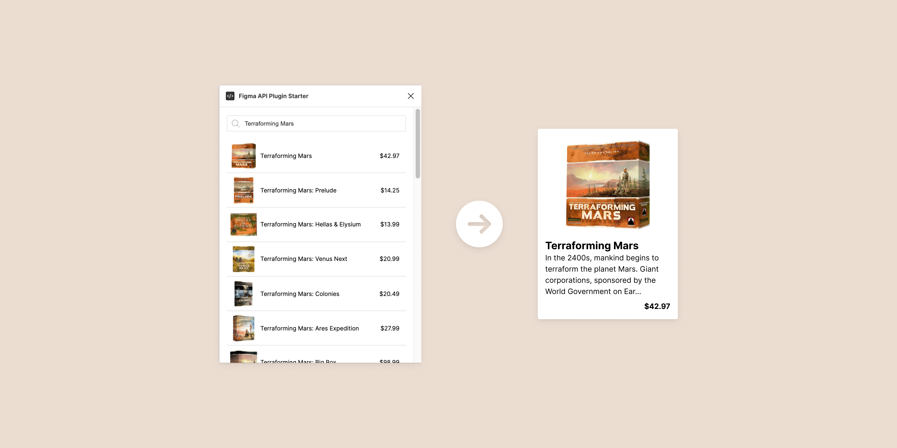

# Figma API Plugin Starter



## Introduction

A starter kit for creating a Figma Plugin with an API to search for products and insert data into a Figma component.
This starter is based on the boilerplate [Figsvelte](https://github.com/thomas-lowry/figsvelte/blob/master/README.md).
For this starter, I used the API of [boardgameatlas.com](https://www.boardgameatlas.com/api/docs), but you can use whatever API you want.

You can duplicate the Figma file here: https://www.figma.com/community/file/1059747883287059565/Figma-API-Plugin-Starter

## To get started

```bash
cd figma-api-plugin-starter
npm install
```

_Note that you will need to have [Node.js](https://nodejs.org/) installed._

## Connecting your plugin to Figma

Connecting your plugin to Figma
After installing, go to **Plugins / Development / New Plugin** in the Figma desktop app for Mac OS or Windows and choose the option **"Link existing plugin"**.

_You also can just type "New Plugin" in Figma global search to go there_

From there you need to link a **manifest.json** file located at **public** folder in your directory:

```bash
/figma-api-plugin-starter/public/manifest.json
```

Now edit this file to give a new name for your plugin, and you will be able call it from Figma: **Plugins / Development / Your Plugin Name**


## Development


During development, watch your project for changes with the following command.

```bash
npm run dev
```

Start building your plugin UI in `'src/PluginUI.svelte'`.

To use the Boardgameatlas API you have to create your own client_id here: https://www.boardgameatlas.com/api/docs/apps


## Build

When ready to package up your final Figma Plugin:

```bash
npm run build
```

## Useful info

To include an external CSS file:

```javascript
import styles from "./styles.css";
```

To include an SVG:

```javascript
import SvgName from './image.svg';

//use in your markup
{@html SvgName}
```

_For more info on using the Icon component system with SVGs from [Figma Plugin DS Svelte](https://github.com/thomas-lowry/figma-plugin-ds-svelte), refer to the repo._

_For info about Figma API visit [Figma API Overview](https://www.figma.com/plugin-docs/api/api-overview/)_
